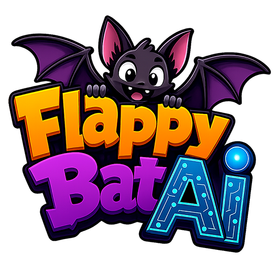
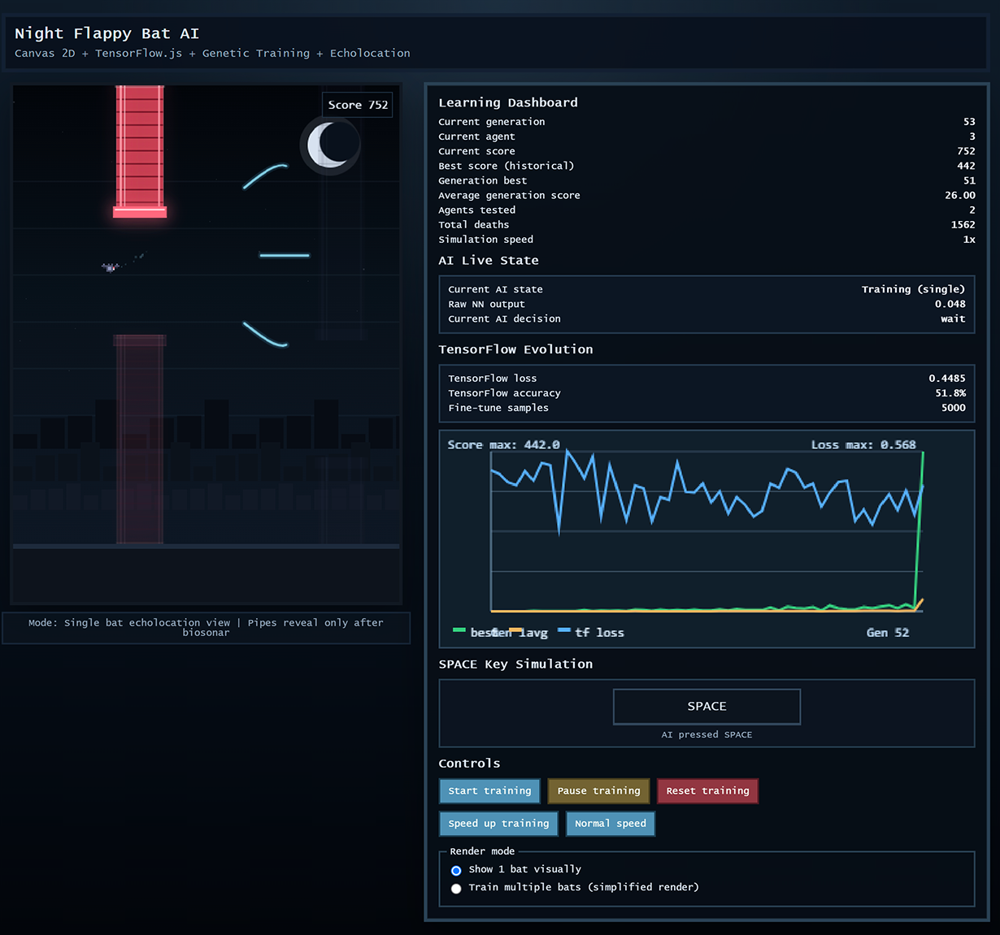
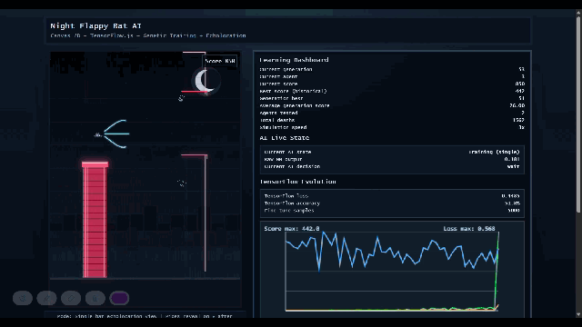
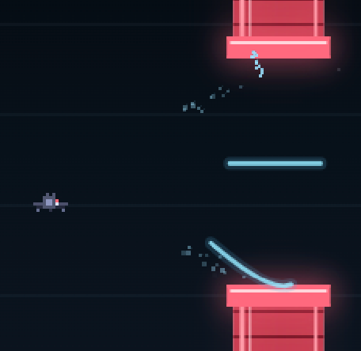

<p align="center">
  
</p>

# Flappy Bat AI

> A browser-based biosonar-inspired training sandbox where a bat agent learns to survive an unpredictable obstacle course with Canvas 2D, TensorFlow.js, and evolutionary training.

Flappy Bat AI is an evolution of the original [game-flapbird](https://github.com/Douglas-sm/game-flapbird). The earlier project focused on obstacle prediction in a more direct way. This version shifts the study toward reaction training inspired by bat echolocation, using a night-themed simulation where pipes are visually revealed by biosonar waves and the agent is evaluated on how well it reacts inside an uncertain environment.

The repository is intended as a case study for how biosonar-like sensing concepts can support machine decision-making. It is useful both as a playable visual training demo and as a reference project for experiments in perception-constrained AI loops, reactive control, and survival-based evolutionary learning.

> Current implementation note
>
> The project theme and rendering are centered on echolocation, and obstacles are visually revealed through biosonar effects. However, the current model still receives normalized next-pipe geometry from `Game.getStateInputs()` as part of its neural-network inputs. This README documents the project accurately as it exists today while framing the broader research goal of moving toward stronger sensor-driven perception.

## Overview

| Item | Details |
| --- | --- |
| Project name | `Flappy Bat AI` |
| Application type | Browser game, AI trainer, and biosonar case study |
| Rendering | HTML5 Canvas 2D |
| AI runtime | TensorFlow.js in the browser |
| Training strategy | Genetic evolution plus TensorFlow fine-tuning |
| Local runtime | Node.js static file server |
| Deployment target | Static build served through Vercel |
| Recommended Node.js | `>=18` |

## From the Original Project to Flappy Bat AI

The original [game-flapbird](https://github.com/Douglas-sm/game-flapbird) established the base idea of an autonomous Flappy-style agent. Flappy Bat AI keeps the core survival challenge but changes the research angle in important ways:

- The visual identity changes from a bird to a bat and introduces a night environment tailored to biosonar-inspired feedback.
- The simulation now treats echolocation as the central design concept instead of only using obstacle anticipation as the primary learning context.
- Pipes are visually revealed through echo pulses, highlights, and return particles, turning perception into part of the learning narrative.
- The repository is positioned as a case study for reactive intelligence in unpredictable environments, not only as a simple game clone with AI attached.

In practical terms, this project studies how a model can improve decision-making when perception is framed around sensing and response timing. That makes it a useful foundation for future experiments involving sparse sensing, delayed observation, or stronger sensor-gated inputs.

## Why This Project Exists

The main objective is to study reaction training under biosonar-inspired conditions.

Instead of presenting the environment as something the player or model can always understand at a glance, the project explores a bat-centric interpretation of perception:

- the bat emits repeated echo pulses
- the world becomes readable through wave contact and return feedback
- decisions must be taken continuously while the environment remains dynamic and partially uncertain

This makes Flappy Bat AI a useful prototype for thinking about:

- AI agents that rely on constrained or delayed perception
- survival policies in fast-moving environments
- decision systems that must react instead of planning from complete information
- biosonar-inspired interfaces for future game AI or simulation studies

## Demo Assets

### Main dashboard view



### Training loop in motion



### Echolocation-inspired obstacle reveal



## Core Study Idea: Biosonar and Echolocation

Real bats navigate by emitting sounds and interpreting the returning echoes. Flappy Bat AI translates that idea into a browser simulation:

- the bat emits recurring wave pulses
- waves travel forward in three directions
- when a wave intersects a pipe section, that obstacle section is highlighted
- return particles visually travel back toward the bat
- the reveal effect fades over time, reinforcing the sense of temporary perception

This is not a physics-accurate biosonar simulator. It is a stylized training environment designed to make sensing and reaction part of the AI story and the user-facing visualization.

## How the Simulation Works

The simulation runs entirely on the client side. The browser owns rendering, gameplay updates, neural-network inference, and the evolutionary loop. Node.js only serves the files locally.

### World model

The `Game` class manages the environment with these default values:

| Setting | Value |
| --- | --- |
| Canvas size | `480 x 640` |
| Floor height | `72` |
| Gravity | `0.28` |
| Max fall speed | `6` |
| Jump force | `-4.8` |
| Pipe width | `58` |
| Pipe gap | `145` |
| Pipe spacing | `210` |
| Pipe speed | `2.2` |

Each run starts with two pipes already spawned ahead of the bat. As the bat survives, old pipes move offscreen, new pipes are generated, and the score increases whenever the bat passes a pipe pair.

### Bat behavior

The bat is rendered from pixel blocks by `js/bird.js` and updated with simple vertical physics:

- gravity pulls the bat down every step
- a jump instantly applies a negative vertical velocity
- the bat dies if it touches a pipe, the ceiling, or the ground
- the wing animation loops while the simulation runs

### Echolocation effects

The biosonar presentation is handled in `js/game.js` and `js/pipe.js`.

Current effect defaults:

| Setting | Value |
| --- | --- |
| Echo pulse interval | `26` ticks |
| Echo wave speed | `12` |
| Echo wave trail | `58` |
| Echo max distance | `270` |
| Max echo particles | `180` |

The game emits three curved wave directions on each pulse. When one of those waves intersects a pipe section:

- the matching pipe section starts a timed reveal animation
- the reveal is drawn with an outline-first progression and a filled scan effect
- a burst of particles is emitted from the collision point
- those particles drift back toward the bat to simulate returning echo feedback

### Render modes

The UI supports two training modes:

- `single`: one bat is shown clearly, agents are evaluated one at a time, and the scene is fully rendered for observation
- `batch`: the population runs in parallel with simplified rendering, and the observed view follows the first living agent for faster training

Batch mode advances `speed * 3` simulation steps per animation frame, which makes it much faster for training than the single-agent view.

## How the AI Works

The AI lives in `js/ai.js` and uses TensorFlow.js directly in the browser.

### Neural-network inputs

The current model receives five normalized values:

| Input | Meaning |
| --- | --- |
| `birdY` | Bat vertical position relative to the playable height |
| `velocityY` | Current vertical velocity normalized against fall speed |
| `distanceX` | Horizontal distance to the next pipe |
| `gapTop` | Top boundary of the next pipe gap |
| `gapBottom` | Bottom boundary of the next pipe gap |

These inputs are produced by `Game.getStateInputs()`. They give the model a compact view of the immediate obstacle situation.

### Neural-network architecture

```text
5 inputs -> Dense(8, relu) -> Dense(6, relu) -> Dense(1, sigmoid)
```

The final sigmoid output is interpreted as a flap decision:

```text
output >= 0.5 => jump
output <  0.5 => wait
```

### Model capabilities

Each `BirdBrain` supports:

- inference through `predict()`
- duplication through `clone()`
- weight recombination through `crossover()`
- random perturbation through `mutate()`
- supervised refinement through `trainWithExamples()`

The model is compiled lazily only when fine-tuning is needed, using:

- optimizer: Adam
- learning rate: `0.003`
- loss: binary cross-entropy
- metric: accuracy

## How Training Works

The training loop is implemented in `js/training.js`. It combines population-based evolution with a TensorFlow fine-tuning step applied to a mentor model each generation.

### Default training configuration

| Setting | Value |
| --- | --- |
| Population size | `30` agents |
| Elite count | `4` |
| Mutation rate | `0.12` |
| Mutation amount | `0.32` |
| Fine-tune epochs | `4` |
| Fine-tune batch size | `64` |
| Fine-tune elite source | top `6` ranked agents |
| Fine-tune max samples | `5000` |
| Max experiences per agent | `2200` |
| History points kept in chart | `120` |
| Max training speed | `12x` |

### Generation lifecycle

Each generation follows this flow:

1. Create or reset the bat population.
2. Let each agent play until death.
3. Record inputs and binary actions as experience samples during play.
4. Score each agent with a survival-oriented fitness function.
5. Rank the population by fitness.
6. Clone the best brain into a mentor model.
7. Fine-tune the mentor model with curated elite experiences.
8. Preserve elites, generate children through crossover and mutation, and start the next generation.

### Fitness

Fitness is intentionally simple:

```text
fitness = score * 160 + frames_survived
```

This rewards both forward progress and stability. Passing pipes matters more than merely staying alive for a few extra frames, but frame survival still influences the ranking.

### Experience recording

While an agent is alive, the training manager stores:

- the five normalized state inputs
- the binary action taken by the current brain

Those experiences are later reused during the TensorFlow fine-tuning phase.

### TensorFlow fine-tuning phase

At the end of a generation, the best-performing brain is cloned into a mentor model. That mentor can then be refined with a supervised dataset built from elite agents.

The dataset builder:

- selects the top `6` agents or fewer if the generation is smaller
- samples from their recorded experiences using a stride to avoid overloading the dataset
- caps the total dataset at `5000` samples
- skips training if there are fewer than `24` samples

Each label is blended from two sources:

- the action actually taken by the elite agent
- a rule-based coaching heuristic

The blend weight depends on how strong that agent was relative to the best score in the elite set. Higher-performing agents are trusted more heavily.

### Coaching heuristic

The rule-based coach estimates whether the bat should jump based on:

- current bat height
- current vertical velocity
- next-gap center
- how near the next pipe is

Internally, the heuristic computes an urgency value and returns either `1` or `0`. That makes the fine-tune step a hybrid between imitation of successful agents and a light corrective signal.

### Parent selection, crossover, and mutation

After fine-tuning:

- the mentor model becomes the first agent of the next generation
- the remaining elites are cloned directly
- new children are created until the population is full

Parent selection uses tournament-style sampling from the top half of the ranked pool. Children are created by per-weight crossover and then mutated with the configured mutation rate and amount.

### What the dashboard tracks

The interface exposes live training metrics while the simulation runs:

- current generation
- current observed agent
- current score
- historical best score
- best score inside the current generation
- average generation score
- tested agents count
- total deaths
- current simulation speed
- AI state
- raw neural-network output
- current decision (`jump` or `wait`)
- TensorFlow loss
- TensorFlow accuracy
- fine-tune sample count
- a history chart for best score, average score, and TensorFlow loss

The SPACE key widget also mirrors whether the current observed agent is effectively "pressing jump" at that moment.

## Tech Stack

- `HTML5` for the application shell
- `CSS3` for layout, theming, and dashboard styling
- `JavaScript ES Modules` for the game, AI, UI, and training logic
- `Canvas 2D API` for the bat, pipes, echo waves, particles, and chart rendering
- `TensorFlow.js 4.22.0` loaded from CDN for inference, crossover support, mutation, and fine-tuning
- `Node.js` for local static serving and build scripts
- `Vercel` configuration for deployment of the generated static output

## Project Structure

```text
.
|-- api/
|   `-- index.js
|-- assets/
|   `-- demo/
|       |-- demo.webp
|       |-- echolocation.webp
|       |-- logo.webp
|       `-- motion.gif
|-- js/
|   |-- ai.js
|   |-- bird.js
|   |-- evolution-chart.js
|   |-- game.js
|   |-- main.js
|   |-- pipe.js
|   |-- training.js
|   `-- ui.js
|-- scripts/
|   `-- build-static.js
|-- index.html
|-- package.json
|-- server.js
|-- style.css
`-- vercel.json
```

## Installation

### Requirements

- Node.js `18` or newer
- a modern browser with ES module support
- internet access on first load if TensorFlow.js is not already cached locally

TensorFlow.js is loaded from:

```html
https://cdn.jsdelivr.net/npm/@tensorflow/tfjs@4.22.0/dist/tf.min.js
```

### Install with pnpm

```bash
pnpm install
```

### Install with npm

```bash
npm install
```

The project currently does not declare local runtime dependencies, but running the install step keeps the workflow consistent and validates the package metadata.

## Running the Project

### Start with pnpm

```bash
pnpm start
```

### Start with npm

```bash
npm start
```

Then open:

```text
http://localhost:3000
```

The local server binds to `0.0.0.0` and uses port `3000` by default.

### Override the port

```bash
PORT=4000 npm start
```

or

```bash
PORT=4000 pnpm start
```

## Available Commands

| Command | Description |
| --- | --- |
| `pnpm start` | Starts the local static server |
| `pnpm dev` | Alias of `start` for local development |
| `pnpm run build` | Generates the production-ready `dist/` directory |
| `npm start` | Starts the local static server |
| `npm run dev` | Alias of `start` for local development |
| `npm run build` | Generates the production-ready `dist/` directory |

## Controls and Usage

When the page opens, the simulation is initialized but paused. Use the right-side dashboard controls to interact with the training loop.

### Main controls

| Control | Behavior |
| --- | --- |
| `Start training` | Starts or resumes the simulation |
| `Pause training` | Pauses without resetting the current generation |
| `Reset training` | Rebuilds the population and clears accumulated history |
| `Speed up training` | Increases training speed by `1x` up to `12x` |
| `Normal speed` | Returns the simulation to `1x` |

### Render mode controls

| Mode | Behavior |
| --- | --- |
| `Show 1 bat visually` | Sequential single-agent observation with full visual detail |
| `Train multiple bats (simplified render)` | Population-wide training with a simplified scene and higher throughput |

## Local Server Behavior

The local server is implemented in `server.js`.

It:

- serves `index.html`, `style.css`, everything under `js/`, and everything under `assets/`
- rejects unsupported methods and only allows `GET` and `HEAD`
- prevents access to non-public files such as `server.js` itself
- sends `Cache-Control: no-store` so local changes are easy to test

This keeps the project simple while still acting as a proper local web server for ES modules and static assets.

## Build and Deployment

### Static build

Generate a production build with:

```bash
pnpm run build
```

or:

```bash
npm run build
```

The build script in `scripts/build-static.js`:

- deletes any previous `dist/`
- recreates the directory
- copies `index.html`
- copies `style.css`
- copies the entire `js/` directory
- copies the entire `assets/` directory

### Vercel deployment flow

The repository is already prepared for Vercel:

- `vercel.json` defines `pnpm run build` as the build command
- the output directory is `dist`
- all routes are rewritten to `api/index.js`
- `api/index.js` serves files from `dist/` through the same static handler logic used locally

That means the browser app remains static, while the serverless function simply resolves and serves the generated files.

## Development Notes

- Training happens in the browser, not in Node.js.
- The app uses `tf.tidy()` and explicit tensor disposal to reduce memory growth.
- The chart visualizes historical best score, average score, and TensorFlow loss.
- Canvas image smoothing is disabled to preserve the pixel-art style.
- Batch mode sacrifices visual richness to accelerate iteration speed.
- The current codebase already communicates the biosonar concept strongly through rendering and UX, even though the model inputs are not yet fully restricted to sensor-only echo signals.

## Troubleshooting

### The page opens but the AI does not run

- Make sure you clicked `Start training`.
- Check the browser console for TensorFlow loading errors.
- Confirm that your browser supports ES modules.

### The page is blank or partially broken

- Verify that you are using the local server instead of opening `index.html` directly from the filesystem.
- Confirm that TensorFlow.js can be loaded from the CDN.
- Make sure the `js/` and `assets/` folders are available relative to the served root.

### The Vercel function does not serve the app correctly

- Run the build step before testing the serverless handler locally.
- Confirm that `dist/` contains `index.html`, `style.css`, `js/`, and `assets/`.
- Check that the rewrite rule in `vercel.json` still points every path to `api/index.js`.

## Future Research Directions

Flappy Bat AI already works as a strong educational and visual case study, but it also points to several natural follow-up experiments:

- replacing direct geometric inputs with true echo-derived features only
- introducing noisy or delayed biosonar returns
- comparing pure evolution against pure supervised fine-tuning
- testing richer state encodings or recurrent policies
- measuring how sensor constraints affect survival, stability, and generalization

That is the broader value of the project: it turns a familiar arcade problem into a compact laboratory for studying reactive AI under biosonar-inspired constraints.
